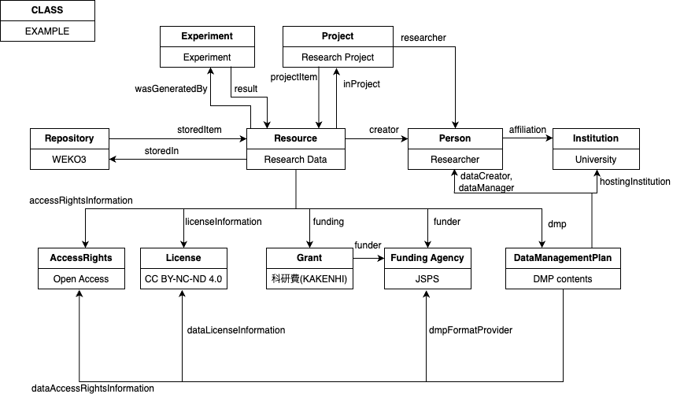
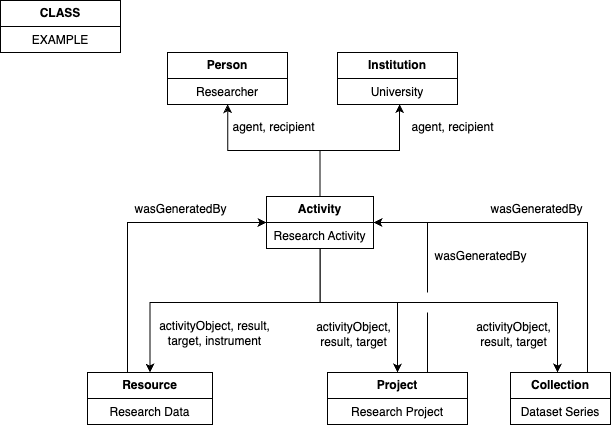

# Domain Model
There is two domain model of RDM Ontology; focused on Resource and focused on Activity. The former is focused on describing Resource as a outcome of research activities. The latter is focused on research activities itself. These two can be linked by using rdm property, however, it is not recommended because of the complexity.

## Domain Model Focused on Resource

To describe research outcomes such as research data, the main entity should be of type Resource. (It is recommended that a subclass of Resource be selected and used according to the category of research outcomes.) Related entities such as research project can be described by linking to the main entity. Activity entities is not recommended to add to this style of describing to divide the result of research activity (Resource) and the process (Activity).
Examples of Resource focused description is in two formats:
- [JSON-LD](../example/example_research_data.json)
- [turtle](../example/example_research_data.ttl)

## Domain Model Focused on Activity

To describe research activities as a log, the main entity should be a subclass of Activity class. Resource entities can be linked as a result, a target and a used tool of the activity. Linking other entities to Resource is not recommended when the main entity is subclass of Activity, as well as Resourced focused case. 

# Term Definitions Overview
|prefix|Namespace|
|--|--|
|rdm|https://purl.org/rdm/ontology/|
|owl|http://www.w3.org/2002/07/owl#|
|rdf|http://www.w3.org/1999/02/22-rdf-syntax-ns#|
|rdfs|http://www.w3.org/2000/01/rdf-schema#|
|xsd|http://www.w3.org/2001/XMLSchema#|

The following is a legend of term description.
||Term|
|--|--|
|URI|URI to the term|
|rdfs:comment|Comment in English<br>Comment in Japanese|
|rdf:type|owl:ObjectProperty or owl:DatatypeProperty|
|rdfs:subClassOf/rdfs:subPropertyOf|super class/property|
|owl:inverseOf| inverse property|
|rdfs:domain|Domain class. Any of classes in list can be domain when multiple classes are listed. (unionOf)|
|rdfs:range|Range class or datatype. Any of these in list can be range when multiple items are listed.(unionOf)|
|note|Additional description|

## Classes
||rdm:AccessRights|
|--|--|
|URI|https://purl.org/rdm/ontology/AccessRights|
|rdfs:comment|An access right o Resource.<br>リソースへのアクセス権|
|rdfs:subClassOf|RightsStatement|
|note|A value of property rdm:conditionOfAccess is required.<br> A value of property rdm:dateAvailable is required when the value of rdm:conditionOfAccess is _rdm:EmbargoedAccess_.|

||rdm:Accept|
|--|--|
|URI|https://purl.org/rdm/ontology/Accept|
|rdfs:comment|An act of approving Resource or request.<br>Resource や依頼を承認する行動|
|rdfs:subClassOf|Activity|

||rdm:Activity|
|--|--|
|URI|https://purl.org/rdm/ontology/Activity|
|rdfs:comment|An action or activity.<br>行動や行為|

||rdm:Add|
|--|--|
|URI|https://purl.org/rdm/ontology/Add|
|rdfs:comment|An act of adding metadata to Resource.<br>Resource にメタデータを付与する行動|
|rdfs:subClassOf|Activity|

||rdm:Align|
|--|--|
|URI|https://purl.org/rdm/ontology/Align|
|rdfs:comment|An act of editing Resource to format.<br>Resource をフォーマットに合わせて編集する行動|
|rdfs:subClassOf|Edit|

||rdm:Anonymize|
|--|--|
|URI|https://purl.org/rdm/ontology/Anonymize|
|rdfs:comment|An act of making Resource anonymous.<br>Resource を匿名化する行動|
|rdfs:subClassOf|Edit|

||rdm:Archive|
|--|--|
|URI|https://purl.org/rdm/ontology/Archive|
|rdfs:comment|An act of archiving Resource.<br>Resource をアーカイブする行動|
|rdfs:subClassOf|Preserve|

||rdm:Ask|
|--|--|
|URI|https://purl.org/rdm/ontology/Ask|
|rdfs:comment|An act of asking questions to Person, chatbot etc.<br>Person やチャットボットなどに質問をする行動|
|rdfs:subClassOf|Activity|

||rdm:Assign|
|--|--|
|URI|https://purl.org/rdm/ontology/Assign|
|rdfs:comment|An act of assigning a role to Person.<br>Person に役割を任命する行動|
|rdfs:subClassOf|Activity|

||rdm:Audio|
|--|--|
|URI|https://purl.org/rdm/ontology/Audio|
|rdfs:comment|An audio file.<br>音声|
|rdfs:subClassOf|Resource|

||rdm:Authorize|
|--|--|
|URI|https://purl.org/rdm/ontology/Authorize|
|rdfs:comment|An act of granting permission or right to an object.<br>権利や許可を与える行動|
|rdfs:subClassOf|Activity|

||rdm:Book|
|--|--|
|URI|https://purl.org/rdm/ontology/Book|
|rdfs:comment|A book.<br>書籍|
|rdfs:subClassOf|Resource|

||rdm:Check|
|--|--|
|URI|https://purl.org/rdm/ontology/Check|
|rdfs:comment|An act of checking the regulation for Resource, such as using checkboxes.<br>チェックボックスに印をつけるなど、規定の項目に関して確認する行動|
|rdfs:subClassOf|Activity|

||rdm:Cleanse|
|--|--|
|URI|https://purl.org/rdm/ontology/Cleanse|
|rdfs:comment|An act of performing data cleansing of Resource.<br>Resource をデータクレンジングする行動|
|rdfs:subClassOf|Edit|

||rdm:Collect|
|--|--|
|URI|https://purl.org/rdm/ontology/Collect|
|rdfs:comment|An act of collecting Resource.<br>Resource を収集する行動|
|rdfs:subClassOf|Activity|

||rdm:Collection|
|--|--|
|URI|https://purl.org/rdm/ontology/Collection|
|rdfs:comment|A collection of items.<br>オブジェクトのコレクション|

||rdm:Comment|
|--|--|
|URI|https://purl.org/rdm/ontology/Comment|
|rdfs:comment|An act of generating a comment on Resource.<br>Resource に対してコメントをする行動|
|rdfs:subClassOf|Activity|

||rdm:ConditionOfAccessEnumeration|
|--|--|
|URI|https://purl.org/rdm/ontology/ConditionOfAccessEnumeration|
|rdfs:comment|An option of object for property rdm:conditionOfAccess.<br>プロパティ rdm:conditionOfAccess の目的語の選択肢|
|rdfs:subClassOf|Enumeration|
|note|This class is only used as a type for enumeration of the value of _rdm:conditionOfAccess_.|

||rdm:ConferenceObject|
|--|--|
|URI|https://purl.org/rdm/ontology/ConferenceObject|
|rdfs:comment|A Resource related to conferences.<br>カンファレンスに関連するリソース|
|rdfs:subClassOf|Resource|

||rdm:ConferencePaper|
|--|--|
|URI|https://purl.org/rdm/ontology/ConferencePaper|
|rdfs:comment|A conference paper.<br>カンファレンスペーパー|
|rdfs:subClassOf|Resource|

||rdm:ConferenceProceeding |
|--|--|
|URI|https://purl.org/rdm/ontology/ConferenceProceeding |
|rdfs:comment|A conference proceeding.<br>カンファレンスプロシーディング|
|rdfs:subClassOf|Resource|

||rdm:Connect|
|--|--|
|URI|https://purl.org/rdm/ontology/Connect|
|rdfs:comment|An act of connecting service to another service.<br>サービスを別のサービスに接続する行動|
|rdfs:subClassOf|Activity|

||rdm:Convert|
|--|--|
|URI|https://purl.org/rdm/ontology/Convert|
|rdfs:comment|An act of converting Resource into a new Resource.<br>Resource を新たな Resource に変換する行動|
|rdfs:subClassOf|Activity|

||rdm:Create|
|--|--|
|URI|https://purl.org/rdm/ontology/Create|
|rdfs:comment|An act of creating/producing/generating Resource, Project, Collection etc.<br>Project, Resource, Collection などを作成する行動|
|rdfs:subClassOf|Activity|

||rdm:DataManagementPlan|
|--|--|
|URI|https://purl.org/rdm/ontology/DataManagementPlan|
|rdfs:comment|A data management plan (DMP).<br>データ管理計画(DMP)|
|note|This class corresponds to a set of data manager, access rights, license and so on, such as a single row in DMP format. Multiple instance of this class can be linked to a rdm:Project class to describe several set of data management plan.|

||rdm:Dataset|
|--|--|
|URI|https://purl.org/rdm/ontology/Dataset|
|rdfs:comment|A dataset.<br>データセット|
|rdfs:subClassOf|Resource|

||rdm:Deploy|
|--|--|
|URI|https://purl.org/rdm/ontology/Deploy|
|rdfs:comment|An act of deploying SoftwareApplication or Resource.<br>Resource, SoftwareApplicationをデプロイする行動|
|rdfs:subClassOf|Activity|

||rdm:Develop|
|--|--|
|URI|https://purl.org/rdm/ontology/Develop|
|rdfs:comment|An act of developing a program.<br>プログラミングで実装する行動|
|rdfs:subClassOf|Activity|

||rdm:Download|
|--|--|
|URI|https://purl.org/rdm/ontology/Download|
|rdfs:comment|An act of downloading Resource.<br>Resource をダウンロードする行動|
|rdfs:subClassOf|Activity|

||rdm:Dump|
|--|--|
|URI|https://purl.org/rdm/ontology/Dump|
|rdfs:comment|An act of creating a log file by dumping.<br>ダンプによりログファイルを作成する行動|
|rdfs:subClassOf|Activity|

||rdm:Edit|
|--|--|
|URI|https://purl.org/rdm/ontology/Edit|
|rdfs:comment|An act of editing Resource. This class implies that changes have been made to the Resource as a draft, such as using edit UI, and does not involve whether they have been applied.<br>Resource に変更を加える行動. 編集画面を利用したドラフトとしての変更を意味し、与えた変更の反映は含意しない|
|rdfs:subClassOf|Activity|

||rdm:EducationalResource|
|--|--|
|URI|https://purl.org/rdm/ontology/EducationalResource|
|rdfs:comment|A Resource related to educational, such as slides for lecture.<br>教育関連資料|
|rdfs:subClassOf|Resource|

||rdm:Enumeration|
|--|--|
|URI|https://purl.org/rdm/ontology/Enumeration|
|rdfs:comment|A Class for individuals of object enumeration.<br>プロパティの選択肢列挙のためのクラス|
|note|This class is only used as a super-class of any enumeration class, not for instance.|

||rdm:Evaluate|
|--|--|
|URI|https://purl.org/rdm/ontology/Evaluate|
|rdfs:comment|An act of evaluating Resource, such as peer-review.<br>ピアレビューなど、Resource を評価する行動|
|rdfs:subClassOf|Activity|

||rdm:Event|
|--|--|
|URI|https://purl.org/rdm/ontology/Event|
|rdfs:comment|An event, such as conferences etc.<br>学会など、イベントや催し物|

||rdm:Execute|
|--|--|
|URI|https://purl.org/rdm/ontology/Execute|
|rdfs:comment|An act of executing SoftwareApplication, Resource, program etc.<br>Resource, SoftwareApplication, プログラムを実行する行動|
|rdfs:subClassOf|Activity|

||rdm:FundingAgency|
|--|--|
|URI|https://purl.org/rdm/ontology/FundingAgency|
|rdfs:comment|An organization that funds research activities.<br>研究資金提供機関|
|rdfs:subClassOf|Institution|

||rdm:Get|
|--|--|
|URI|https://purl.org/rdm/ontology/Get|
|rdfs:comment|An act of getting/obtaining Resource, information etc.<br>Resource または情報などを取得する行動|
|rdfs:subClassOf|Activity|

||rdm:Grant|
|--|--|
|URI|https://purl.org/rdm/ontology/Grant|
|rdfs:comment|A grant for research activities.<br>研究資金プログラム|

||rdm:Identifier|
|--|--|
|URI|https://purl.org/rdm/ontology/Identifier|
|rdfs:comment|An identifier.<br>識別子|

||rdm:Image|
|--|--|
|URI|https://purl.org/rdm/ontology/Image|
|rdfs:comment|An image file.<br>画像|
|rdfs:subClassOf|Resource|

||rdm:Inform|
|--|--|
|URI|https://purl.org/rdm/ontology/Inform|
|rdfs:comment|An act of notifying Person/Institution of information.<br>Person, Institution に対して通知する行動|
|rdfs:subClassOf|Activity|

||rdm:Ingest|
|--|--|
|URI|https://purl.org/rdm/ontology/Ingest|
|rdfs:comment|An act of getting and adding metadata to Resource from public information as part of data curation.<br>キュレーションの一環として、Resource のメタデータを外部から取得し付与する行動|
|rdfs:subClassOf|Activity|

||rdm:Institution|
|--|--|
|URI|https://purl.org/rdm/ontology/Institution|
|rdfs:comment|An organization.<br>機関や組織|

||rdm:Integrate|
|--|--|
|URI|https://purl.org/rdm/ontology/Integrate|
|rdfs:comment|An act of integrating different forms of metadata as part of data curation.<br>キュレーションの一環として、メタデータを統合する行動|
|rdfs:subClassOf|Activity|

||rdm:Journal|
|--|--|
|URI|https://purl.org/rdm/ontology/Journal|
|rdfs:comment|A journal.<br>ジャーナル|
|rdfs:subClassOf|Resource|

||rdm:JournalArticle|
|--|--|
|URI|https://purl.org/rdm/ontology/JournalArticle|
|rdfs:comment|An article published in a journal.<br>ジャーナル論文|
|rdfs:subClassOf|Resource|

||rdm:License|
|--|--|
|URI|https://purl.org/rdm/ontology/License|
|rdfs:comment|A license of Resource.<br>リソースのライセンス|
|rdfs:subClassOf|RightsStatement|
|note|A value of property rdm:url is required.|

||rdm:OtherResource|
|--|--|
|URI|https://purl.org/rdm/ontology/OtherResource|
|rdfs:comment|An other Resource.<br>その他のリソース|
|rdfs:subClassOf|Resource|
|note|This class can be used only when no other subclass of Resource is appropriate.|

||rdm:Person|
|--|--|
|URI|https://purl.org/rdm/ontology/Person|
|rdfs:comment|A person.<br>人物|

||rdm:Preprint|
|--|--|
|URI|https://purl.org/rdm/ontology/Preprint|
|rdfs:comment|A preprint.<br>プレプリント|
|rdfs:subClassOf|Resource|

||rdm:Preserve|
|--|--|
|URI|https://purl.org/rdm/ontology/Preserve|
|rdfs:comment|An act of saving and storing Resource to Repository, SoftwareApplication etc.<br>Resource を Repository, SoftwareApplication などに保存・保管する行動|
|rdfs:subClassOf|Activity|

||rdm:Project|
|--|--|
|URI|https://purl.org/rdm/ontology/Project|
|rdfs:comment|A research project.<br>研究プロジェクト|

||rdm:Publish|
|--|--|
|URI|https://purl.org/rdm/ontology/Publish|
|rdfs:comment|An act of making Resource public, such as by pushing "publish" button on publishing service. (including Resource of any access rights)<br>公開ボタンを押すなどして、Resource を公開する行動(アクセス権の種類は問わない)|
|rdfs:subClassOf|Activity|

||rdm:Record|
|--|--|
|URI|https://purl.org/rdm/ontology/Record|
|rdfs:comment|An act of mechanically adding some information to Resource etc.<br>機械的に何かしらの情報を Resource などに付与する行動|
|rdfs:subClassOf|Activity|

||rdm:Register|
|--|--|
|URI|https://purl.org/rdm/ontology/Register|
|rdfs:comment|An act of registering Resource to Repository, SoftwareApplication or other service.<br>Repository, SoftwareApplication もしくはその他サービスに、 Resource を登録する行動|
|rdfs:subClassOf|Activity|

||rdm:Reject|
|--|--|
|URI|https://purl.org/rdm/ontology/Reject|
|rdfs:comment|An act of rejecting proposal/assigned role/submitted Resource etc.<br>提出された Resource や提案、割り当てられた役割などを取り下げる行動|
|rdfs:subClassOf|Activity|

||rdm:Rename|
|--|--|
|URI|https://purl.org/rdm/ontology/Rename|
|rdfs:comment|An act of renaming Resource.<br>Resource の名称を変更する行動|
|rdfs:subClassOf|Activity|

||rdm:Reorganize|
|--|--|
|URI|https://purl.org/rdm/ontology/Reorganize|
|rdfs:comment|An act of changing folder structure of Dataset.<br>Dataset のフォルダ構成を変更する行動|
|rdfs:subClassOf|Activity|

||rdm:Report|
|--|--|
|URI|https://purl.org/rdm/ontology/Report|
|rdfs:comment|A report.<br>レポート、報告書|
|rdfs:subClassOf|Resource|

||rdm:Repository|
|--|--|
|URI|https://purl.org/rdm/ontology/Repository|
|rdfs:comment|A repository.<br>リポジトリ|

||rdm:Request|
|--|--|
|URI|https://purl.org/rdm/ontology/Request|
|rdfs:comment|An act of asking People/Institution to do something.<br>Person, Institution に何らかのタスクを依頼する行動|
|rdfs:subClassOf|Activity|

||rdm:Resource|
|--|--|
|URI|https://purl.org/rdm/ontology/Resource|
|rdfs:comment|A digital object, such as research data, video of experiments rtc.<br>研究データや実験動画など、デジタルオブジェクト|

||rdm:Restructure|
|--|--|
|URI|https://purl.org/rdm/ontology/Restructure|
|rdfs:comment|An act of re-structuring Resource as part of data curation, such as sorting a table.<br>表データをソートするなど、キュレーションの一環として Resource を再構成する行動|
|rdfs:subClassOf|Edit|

||rdm:RightsStatement|
|--|--|
|URI|https://purl.org/rdm/ontology/RightsStatement|
|rdfs:comment|A higer-level class that relates to various rights.<br>権利関係全般に関連するクラス|
|note|This class is only used as a super-class of rdm:AccessRights and rdm:License, not for instance.|

||rdm:Schedule|
|--|--|
|URI|https://purl.org/rdm/ontology/Schedule|
|rdfs:comment|An act of scheduling future Event.<br>未来に行われる Event を設定する行動|
|rdfs:subClassOf|Activity|

||rdm:Search|
|--|--|
|URI|https://purl.org/rdm/ontology/Search|
|rdfs:comment|An act of searching Resource, such as by pushing "search" button.<br>検索ボタンの押下など、Resource を検索する行動|
|rdfs:subClassOf|Activity|

||rdm:Select|
|--|--|
|URI|https://purl.org/rdm/ontology/Select|
|rdfs:comment|An act of selecting from options.<br>選択肢の中から利用するものを選択する行動|
|rdfs:subClassOf|Activity|

||rdm:Semanticize|
|--|--|
|URI|https://purl.org/rdm/ontology/Semantize|
|rdfs:comment|An act of semanticizing metadata as part of data curation.<br>キュレーションの一環として、メタデータを意味付けする行動|
|rdfs:subClassOf|Activity|

||rdm:Send|
|--|--|
|URI|https://purl.org/rdm/ontology/Send|
|rdfs:comment|An act of dispatching Resource.<br>Resource を送る行動|
|rdfs:subClassOf|Activity|

||rdm:SoftwareApplication|
|--|--|
|URI|https://purl.org/rdm/ontology/SoftwareApplication|
|rdfs:comment|A software application.<br>ソフトウェアアプリケーション|

||rdm:Standard|
|--|--|
|URI|https://purl.org/rdm/ontology/Standard|
|rdfs:comment|A standard.<br>標準|
|rdfs:subClassOf|Resource|

||rdm:Submit|
|--|--|
|URI|https://purl.org/rdm/ontology/Submit|
|rdfs:comment|An act of submitting or providing Resource/information.<br>Resource や情報を提出・提供する行動|
|rdfs:subClassOf|Activity|

||rdm:Suggest|
|--|--|
|URI|https://purl.org/rdm/ontology/Suggest|
|rdfs:comment|An act of presenting or proposing options.<br>選択肢を提示する行動|
|rdfs:subClassOf|Activity|

||rdm:Survey|
|--|--|
|URI|https://purl.org/rdm/ontology/Survey|
|rdfs:comment|An act of making a survay of Resource or something.<br>Resource など、何かしらについて調査する行動|
|rdfs:subClassOf|Activity|

||rdm:Thesis|
|--|--|
|URI|https://purl.org/rdm/ontology/Thesis|
|rdfs:comment|A thesis.<br>学位論文|
|rdfs:subClassOf|Resource|

||rdm:Update|
|--|--|
|URI|https://purl.org/rdm/ontology/Update|
|rdfs:comment|An act of updating Resource, such as applying a change.<br>変更を反映させるなど、Resource を更新する行動|
|rdfs:subClassOf|Activity|

||rdm:Upload|
|--|--|
|URI|https://purl.org/rdm/ontology/Upload|
|rdfs:comment|An act of uploading Resource to Repository, SoftwareApplication etc.<br>Resource を SoftwareApplicationやRepository 等にアップロードする行動|
|rdfs:subClassOf|Activity|

||rdm:Video|
|--|--|
|URI|https://purl.org/rdm/ontology/Video|
|rdfs:comment|A video file.<br>動画|
|rdfs:subClassOf|Resource|

||rdm:Visualize|
|--|--|
|URI|https://purl.org/rdm/ontology/Visualize|
|rdfs:comment|An act of creating a visualization based on data, such as making a graph.<br>グラフを生成するなど、データを元に可視化する行動|
|rdfs:subClassOf|Activity|

||rdm:Workflow|
|--|--|
|URI|https://purl.org/rdm/ontology/Workflow|
|rdfs:comment|A workflow.<br>ワークフロー|
|rdfs:subClassOf|Resource|

## Properties
||rdm:accessRightsInformation|
|--|--|
|URI|https://purl.org/rdm/ontology/accessRightsInformation|
|rdf:type|ObjectProperty|
|rdfs:comment|Information on access rights of this Class.<br>クラスのアクセス権関連情報|
|rdfs:domain|rdm:Project|
|rdfs:range|rdm:AccessRights|

||rdm:additionalName|
|--|--|
|URI|https://purl.org/rdm/ontology/additionalName|
|rdf:type|DatatypeProperty|
|rdfs:subPropertyOf|rdm:name|
|rdfs:comment|An additional name for this Person e.g. middle name.<br>ミドルネームなど、その他の名前|
|rdfs:domain|rdm:Person|
|note|This property can be used when rdm:name property already has value.|

||rdm:address|
|--|--|
|URI|https://purl.org/rdm/ontology/address|
|rdf:type|DatatypeProperty|
|rdfs:comment|Address of this Institution.<br>研究機関の住所|
|rdfs:domain|rdm:Institution|
|rdfs:range|xsd:string|

||rdm:affiliation|
|--|--|
|URI|https://purl.org/rdm/ontology/affiliation|
|rdf:type|ObjectProperty|
|rdfs:comment|An organization that this Person is affiliated with.<br>人物の所属先機関|
|rdfs:domain|rdm:Person|
|rdfs:range|rdm:Institution|

||rdm:agent|
|--|--|
|URI|https://purl.org/rdm/ontology/agent|
|rdf:type|ObjectProperty|
|rdfs:comment|The direct performer or driver of this Activity.<br>行動・行為の直接的な実施者|
|rdfs:domain|rdm:Activity|
|rdfs:range|rdm:Person<br>rdm:Institution|

||rdm:approximateSize|
|--|--|
|URI|https://purl.org/rdm/ontology/approximateSize|
|rdf:type|DatatypeProperty|
|rdfs:subPropertyOf|rdm:size|
|rdfs:comment|Approximate size of research data to be described in this DataManagementPlan.<br>DMPにおける概略データ量|
|rdfs:domain|rdm:DataManagementPlan|
|rdfs:range|xsd:string|

||rdm:cites|
|--|--|
|URI|https://purl.org/rdm/ontology/cites|
|rdf:type|ObjectProperty|
|rdfs:subPropertyOf|rdm:isRelatedTo|
|rdfs:comment|A Resource that this Class cites.<br>主語クラスが引用しているリソース|
|owl:inverseOf|rdm:isCitedBy|
|rdfs:domain|rdm:Resource|
|rdfs:range|rdm:Resource|
|rdfs:seeAlso|https://datacite-metadata-schema.readthedocs.io/en/4.5/appendices/appendix-1/relationType/#cites|

||rdm:collectedIn|
|--|--|
|URI|https://purl.org/rdm/ontology/collectedIn|
|rdf:type|ObjectProperty|
|rdfs:comment|A Collection which includes this Resource as a member of Collection.<br>リソースをメンバーとして含むCollection|
|owl:inverseOf|rdm:collectionItem|
|rdfs:domain|rdm:Resource|
|rdfs:range|rdm:Collection|

||rdm:collectionItem|
|--|--|
|URI|https://purl.org/rdm/ontology/collectionItem|
|rdf:type|ObjectProperty|
|rdfs:subPropertyOf|rdm:item|
|rdfs:comment|A Resource included in this Collection.<br>コレクションに含まれるリソース|
|owl:inverseOf|rdm:collectedIn|
|rdfs:domain|rdm:Collection|
|rdfs:range|rdm:Resource|

||rdm:collectionSize|
|--|--|
|URI|https://purl.org/rdm/ontology/collectionSize|
|rdf:type|DatatypeProperty|
|rdfs:subPropertyOf|rdm:size|
|rdfs:comment|The number of items in this Collection.<br>所定のパッケージに含まれるデータセットの総数|
|rdfs:domain|rdm:Collection|
|rdfs:range|xsd:nonNegativeInteger|

||rdm:collects|
|--|--|
|URI|https://purl.org/rdm/ontology/collects|
|rdf:type|ObjectProperty|
|rdfs:subPropertyOf|rdm:isRelatedTo|
|rdfs:comment|A Class which collected/created by using this Class.<br>主語クラスを使用して収集・作成されたクラス|
|owl:inverseOf|rdm:isCollectedBy|
|rdfs:domain|rdm:Resource<br>rdm:Collection<br>rdm:SoftwareApplication|
|rdfs:seeAlso|https://datacite-metadata-schema.readthedocs.io/en/4.5/appendices/appendix-1/relationType/#collects|

||rdm:compiles|
|--|--|
|URI|https://purl.org/rdm/ontology/compiles|
|rdf:type|ObjectProperty|
|rdfs:subPropertyOf|rdm:isRelatedTo|
|rdfs:comment|The result of a compile or creation event using this Class.<br>主語クラスを使用したコンパイルまたは作成イベントの結果|
|owl:inverseOf|rdm:isCompiledBy|
|rdfs:domain|rdm:Resource<br>rdm:SoftwareApplication|
|rdfs:seeAlso|https://datacite-metadata-schema.readthedocs.io/en/4.5/appendices/appendix-1/relationType/#compiles|

||rdm:conditionOfAccess|
|--|--|
|URI|https://purl.org/rdm/ontology/conditionOfAccess|
|rdf:type|ObjectProperty|
|rdfs:comment|Access rights type.<br>アクセス権の種別|
|rdfs:domain|rdm:AccessRights|
|rdfs:range|rdm:ConditionOfAccessEnumeration|
|note|The value of this property MUST be chosen from the named instances which class is rdm:ConditionOfAccessEnumeration.|

||rdm:contact|
|--|--|
|URI|https://purl.org/rdm/ontology/contact|
|rdf:type|DatatypeProperty|
|rdfs:comment|Contacts for data management organizations and managers to be described in this DataManagementPlan.<br>DMPにおけるデータ管理機関・管理者への連絡先|
|rdfs:domain|rdm:DataManagementPlan|
|rdfs:range|xsd:string|

||rdm:continues|
|--|--|
|URI|https://purl.org/rdm/ontology/continues|
|rdf:type|ObjectProperty|
|rdfs:subPropertyOf|rdm:isRelatedTo|
|rdfs:comment|A Class of which this Class is a continuation.<br>主語クラスが継続しているクラス|
|owl:inverseOf|rdm:isContinuedBy|
|rdfs:domain|rdm:Institution<br>rdm:SoftwareApplication<br>rdm:Resource<br>rdm:Repository<br>Project<br>Event|
|rdfs:seeAlso|https://datacite-metadata-schema.readthedocs.io/en/4.5/appendices/appendix-1/relationType/#continues|

||rdm:contributor|
|--|--|
|URI|https://purl.org/rdm/ontology/contributor|
|rdf:type|ObjectProperty|
|rdfs:comment|A contributor to this Class.<br>クラスへの寄与者|
|rdfs:domain|rdm:Resource<br>rdm:Project<br>rdm:Collection<br>rdm:Event<br>rdm:SoftwareApplication|
|rdfs:range|rdm:Person<br>rdm:Institution|
|note|This property can be used only when no other subproperty of this property is appropriate.|

||rdm:copyright|
|--|--|
|URI|https://purl.org/rdm/ontology/copyright|
|rdf:type|DatatypeProperty|
|rdfs:comment|A copyright notice.<br>コピーライト表記|
|rdfs:domain|rdm:License|
|rdfs:range|xsd:string|

||rdm:creator|
|--|--|
|URI|https://purl.org/rdm/ontology/creator|
|rdf:type|ObjectProperty|
|rdfs:subPropertyOf|rdm:contributor|
|rdfs:comment|The creator/author of this Resource. <br>リソースの作成者|
|rdfs:domain|rdm:Resource<br>rdm:SoftwareApplication|
|rdfs:range|rdm:Person|

||rdm:dataAccessRequirements|
|--|--|
|URI|https://purl.org/rdm/ontology/dataAccessRequirements|
|rdf:type|DatatypeProperty|
|rdfs:comment|Conditions and method of access to the Resource under access restrictions.<br>アクセス権が限定公開の場合のアクセス条件と方法|
|rdfs:domain|rdm:AccessRights|
|rdfs:range|xsd:string|

||rdm:dataAccessRightsInformation|
|--|--|
|URI|https://purl.org/rdm/ontology/dataAccessRightsInformation|
|rdf:type|ObjectProperty|
|rdfs:subPropertyOf|rdm:accessRightsInformation|
|rdfs:comment|Information on access rights to be described in this DataManagementPlan.<br>DMPにおけるデータへのアクセス権|
|rdfs:domain|rdm:DataManagementPlan|

||rdm:dataCreator|
|--|--|
|URI|https://purl.org/rdm/ontology/dataCreater|
|rdf:type|ObjectProperty|
|rdfs:subPropertyOf|rdm:creator|
|rdfs:comment|The creator of research data to be described in this DataManagementPlan.<br>DMPにおける研究データの作成者|
|rdfs:domain|rdm:DataManagementPlan|
|rdfs:range|rdm:Person|

||rdm:dataDescription|
|--|--|
|URI|https://purl.org/rdm/ontology/dataDescription|
|rdf:type|DatatypeProperty|
|rdfs:subPropertyOf|rdm:description|
|rdfs:comment|The description of research data to be described in this DataManagementPlan.<br>DMPにおけるデータの説明|
|rdfs:domain|rdm:DataManagementPlan|

||rdm:dataEncodingFormat|
|--|--|
|URI|https://purl.org/rdm/ontology/dataEncodingFormat|
|rdf:type|DatatypeProperty|
|rdfs:subPropertyOf|rdm:encodingFormat|
|rdfs:comment|The format of research data to be described in this DataManagementPlan.<br>DMPで記述した研究データのフォーマット|
|rdfs:domain|rdm:DataManagementPlan|

||rdm:dataIdentifier|
|--|--|
|URI|https://purl.org/rdm/ontology/dataIdentifier|
|rdf:type|ObjectProperty|
|rdfs:subPropertyOf|rdm:identifierInformation|
|rdfs:comment|The identifier of research data to be described in this DataManagementPlan.<br>DMPにおけるデータ識別子|
|rdfs:domain|rdm:DataManagementPlan|
|rdfs:range|rdm:Identifier|

||rdm:dataLicenseInformation|
|--|--|
|URI|https://purl.org/rdm/ontology/dataLicenseInformation|
|rdf:type|ObjectProperty|
|rdfs:subPropertyOf|rdm:licenseInformation|
|rdfs:comment|The license of research data to be described in this DataManagementPlan.<br>DMPにおけるデータのライセンス|
|rdfs:domain|rdm:DataManagementPlan|

||rdm:dataManager|
|--|--|
|URI|https://purl.org/rdm/ontology/dataManager|
|rdf:type|ObjectProperty|
|rdfs:subPropertyOf|rdm:contributor|
|rdfs:comment|The data manager of research data to be described in this DataManagementPlan.<br>DMPにおける研究データ管理者|
|rdfs:domain|rdm:DataManagementPlan|
|rdfs:range|rdm:Person|

||rdm:dataNumber|
|--|--|
|URI|https://purl.org/rdm/ontology/dataNumber|
|rdf:type|DatatypeProperty|
|rdfs:comment|The data number assigned to this DataManagementPlan.<br>DMPにおけるデータNo.|
|rdfs:domain|rdm:DataManagementPlan|
|rdfs:range|xsd:nonNegativeInteger|

||rdm:date|
|--|--|
|URI|https://purl.org/rdm/ontology/date|
|rdf:type|DatatypeProperty|
|rdfs:comment|A date or datetime.<br>日付または日時|
|rdfs:range|xsd:date<br>xsd:dateTime|

||rdm:dateAvailable|
|--|--|
|URI|https://purl.org/rdm/ontology/dateAvailable|
|rdf:type|DatatypeProperty|
|rdfs:subPropertyOf|rdm:date|
|rdfs:comment|Scheduled date of open access of the Resource under the rights of embargoed access.<br>公開猶予の場合の公開予定日|
|rdfs:domain|rdm:AccessRights|
|note|This property is required when the value of rdm:conditionOfAccess is _rdm:EmbargoedAccess_.|

||rdm:dateCreated|
|--|--|
|URI|https://purl.org/rdm/ontology/dateCreated|
|rdf:type|DatatypeProperty|
|rdfs:subPropertyOf|rdm:date|
|rdfs:comment|The date on which this Resource was created.<br>リソースの作成日|
|rdfs:domain|rdm:Resource|

||rdm:dateEnded|
|--|--|
|URI|https://purl.org/rdm/ontology/dateEnded|
|rdf:type|DatatypeProperty|
|rdfs:subPropertyOf|rdm:date|
|rdfs:comment|The end date of this Class.<br>クラスの終了日|
|rdfs:domain|rdm:Project<br>rdm:Event<br>rdm:Activity|

||rdm:dateModified|
|--|--|
|URI|https://purl.org/rdm/ontology/dateModified|
|rdf:type|DatatypeProperty|
|rdfs:subPropertyOf|rdm:date|
|rdfs:comment|The date on which the Resource was most recently modified.<br>リソースの最終更新日|
|rdfs:domain|rdm:Resource|

||rdm:datePublished|
|--|--|
|URI|https://purl.org/rdm/ontology/datePublished|
|rdf:type|DatatypeProperty|
|rdfs:subPropertyOf|rdm:date|
|rdfs:comment|The date on which this Resource was published.<br>リソースの発行日・公開日|
|rdfs:domain|rdm:Resource|

||rdm:dateStarted|
|--|--|
|URI|https://purl.org/rdm/ontology/dateStarted|
|rdf:type|DatatypeProperty|
|rdfs:subPropertyOf|rdm:date|
|rdfs:comment|The start date of this Class.<br>クラスの開始日|
|rdfs:domain|rdm:Project<br>rdm:Event<br>rdm:Activity|

||rdm:dateUpdated|
|--|--|
|URI|https://purl.org/rdm/ontology/dateUpdated|
|rdf:type|DatatypeProperty|
|rdfs:subPropertyOf|rdm:date|
|rdfs:comment|The date on which this Event information was most recently updated.<br>イベントの内容更新日|
|rdfs:domain|rdm:Event|

||rdm:describes|
|--|--|
|URI|https://purl.org/rdm/ontology/describes|
|rdf:type|ObjectProperty|
|rdfs:subPropertyOf|rdm:isRelatedTo|
|rdfs:comment|A Class that this Resource describes.<br>Resource が説明しているクラス|
|owl:inverseOf|rdm:isDescribedBy|
|rdfs:domain|rdm:Resource|
|rdfs:seeAlso|https://datacite-metadata-schema.readthedocs.io/en/4.5/appendices/appendix-1/relationType/#continues|

||rdm:description|
|--|--|
|URI|https://purl.org/rdm/ontology/description|
|rdf:type|DatatypeProperty|
|rdfs:comment|A description of this Class.<br>クラスの説明|
|rdfs:domain|rdm:Resource<br>rdm:Repository<br>rdm:Project<br>rdm:Grant|
|rdfs:range|xsd:string|

||rdm:detailedRole|
|--|--|
|URI|https://purl.org/rdm/ontology/detailedRole|
|rdf:type|DatatypeProperty|
|rdfs:comment|A detailed role of this Person.<br>詳細な役割|
|rdfs:domain|rdm:Person|
|rdfs:range|xsd:string|
|note|This property is for describing detailed role of a Person. When the role can be categorized to one of the subproperties of rdm:contributor, e.g. creator, it is recommended to use it instead of using this property.|

||rdm:detailedType|
|--|--|
|URI|https://purl.org/rdm/ontology/detailedType|
|rdf:type|DatatypeProperty|
|rdfs:comment|A detailed type of this Resource. <br>詳細な資源タイプ|
|rdfs:domain|rdm:Resource|
|rdfs:range|xsd:string|
|note|This property is for describing detailed type of a Resource. When the role can be categorized to one of the subclasses of Resource, e.g. Audio, it is recommended to use it instead of using this property.|

||rdm:dmp|
|--|--|
|URI|https://purl.org/rdm/ontology/dmp|
|rdf:type|ObjectProperty|
|rdfs:comment|Contents of data management plan of this Project/Resource.<br>資源やプロジェクトに紐づくデータ管理計画|
|rdfs:domain|rdm:Resource<br>rdm:Project|
|rdfs:range|rdm:DataManagementPlan|

||rdm:dmpFormat|
|--|--|
|URI|https://purl.org/rdm/ontology/dmpFormat|
|rdf:type|DatatypeProperty|
|rdfs:comment|A name of DataManagementPlan format.<br>DMP種別名|
|rdfs:domain|rdm:DataManagementPlan|
|rdfs:range|xsd:string|

||rdm:dmpFormatProvider|
|--|--|
|URI|https://purl.org/rdm/ontology/dmpFormatProvider|
|rdf:type|ObjectProperty|
|rdfs:comment|A institution which provides this DataManagementPlan format.<br>DMP種別の提供者|
|rdfs:domain|rdm:DataManagementPlan|
|rdfs:range|rdm:Institution|

||rdm:dmpTargetItem|
|--|--|
|URI|https://purl.org/rdm/ontology/dmpTargetItem|
|rdf:type|ObjectProperty|
|rdfs:subPropertyOf|rdm:item|
|rdfs:comment|A Resource described in DataManagementPlan.<br>DMPで対象になっているリソース|
|rdfs:domain|rdm:DataManagementPlan|
|rdfs:range|rdm:Resource|

||rdm:documents|
|--|--|
|URI|https://purl.org/rdm/ontology/documents|
|rdf:type|ObjectProperty|
|rdfs:subPropertyOf|rdm:isRelatedTo|
|rdfs:comment|A  SoftwareApplication which is documented by this Resource.<br>Resource がその説明文書・ドキュメントに相当する SoftwareApplication|
|owl:inverseOf|rdm:isDocumentedBy|
|rdfs:domain|rdm:Resource|
|rdfs:seeAlso|https://datacite-metadata-schema.readthedocs.io/en/4.5/appendices/appendix-1/relationType/#documents|

||rdm:doi|
|--|--|
|URI|https://purl.org/rdm/ontology/doi|
|rdf:type|DatatypeProperty|
|rdfs:subPropertyOf|rdm:identifierValue|
|rdfs:comment|DOI URL.<br>DOI|
|rdfs:domain|rdm:Resource<br>rdm:Repository|
|rdfs:range|xsd:anyURI|
|rdfs:seeAlso|https://www.doi.org/|
|note|This property is a simplified property of identifierValue in the instance of rdm:Identifier with identifierName _DOI_.|

||rdm:email|
|--|--|
|URI|https://purl.org/rdm/ontology/email|
|rdf:type|DatatypeProperty|
|rdfs:comment|Email address.<br>メールアドレス|
|rdfs:domain|rdm:Person|
|rdfs:range|xsd:string|

||rdm:encodingFormat|
|--|--|
|URI|https://purl.org/rdm/ontology/encodingFormat|
|rdf:type|DatatypeProperty|
|rdfs:comment|A MIME format of this Resource.<br>リソースのフォーマット|
|rdfs:domain|rdm:Resource|
|rdfs:range|xsd:string|
|rdfs:seeAlso|http://www.iana.org/assignments/media-types/|
|note|A value MUST be in MIME format.|

||rdm:eradResearcherNumber|
|--|--|
|URI|https://purl.org/rdm/ontology/eradResearcherNumber|
|rdf:type|DatatypeProperty|
|rdfs:subPropertyOf|rdm:identifierValue|
|rdfs:comment|e-rad researcher number.<br>e-rad 研究者番号|
|rdfs:domain|rdm:Person|
|rdfs:range|xsd:string|
|rdfs:seeAlso|https://www.e-rad.go.jp/|
|note|This property is a simplified property of identifierValue in the instance of rdm:Identifier with identifierName _e-Rad研究者番号_.|

||rdm:familyName|
|--|--|
|URI|https://purl.org/rdm/ontology/familyName|
|rdf:type|DatatypeProperty|
|rdfs:subPropertyOf|rdm:name|
|rdfs:comment|Family name.<br>名字|
|rdfs:domain|rdm:Person|

||rdm:field|
|--|--|
|URI|https://purl.org/rdm/ontology/field|
|rdf:type|DatatypeProperty|
|rdfs:comment|A research field of this Project/Resource.<br>プロジェクト・リソースの主題|
|rdfs:domain|rdm:Resource<br>rdm:Project|
|rdfs:range|one of {ライフサイエンス,情報通信,環境,ナノテク・材料,エネルギー,ものづくり技術,社会基盤,フロンティア,人文・社会,その他}|

||rdm:funder|
|--|--|
|URI|https://purl.org/rdm/ontology/funder|
|rdf:type|ObjectProperty|
|rdfs:comment|An organization that funds this Project or research activities to create this Resource.<br>研究資金プログラム提供者|
|rdfs:domain|rdm:Resource<br>rdm:Project<br>rdm:Grant|
|rdfs:range|rdm:FundingAgency|

||rdm:funderId|
|--|--|
|URI|https://purl.org/rdm/ontology/funderId|
|rdf:type|DatatypeProperty|
|rdfs:subPropertyOf|rdm:identifierValue|
|rdfs:comment|Funder ID.<br>助成機関識別子|
|rdfs:domain|rdm:FundingAgency|
|rdfs:range|xsd:string|
|rdfs:seeAlso|https://www.crossref.org/services/funder-registry/|
|note|This property is a simplified property of identifierValue in the instance of rdm:Identifier with identifierName _funderID_.|

||rdm:funding|
|--|--|
|URI|https://purl.org/rdm/ontology/funding|
|rdf:type|ObjectProperty|
|rdfs:comment|A grant program for this Project or research activities to create this Resource.<br>研究資金プログラム|
|rdfs:domain|rdm:Resource<br>rdm:Project|
|rdfs:range|rdm:Grant|

||rdm:givenName|
|--|--|
|URI|https://purl.org/rdm/ontology/givenName|
|rdf:type|DatatypeProperty|
|rdfs:subPropertyOf|rdm:name|
|rdfs:comment|Given name.<br>ファーストネーム|
|rdfs:domain|rdm:Person|

||rdm:hasMetadata|
|--|--|
|URI|https://purl.org/rdm/ontology/hasMetadata|
|rdf:type|ObjectProperty|
|rdfs:subPropertyOf|rdm:isRelatedTo|
|rdfs:comment|A Resource which has additional metadata of this Class.<br>主語クラスの追加メタデータを持つ Resource|
|owl:inverseOf|rdm:isMetadataFor|
|rdfs:range|rdm:Resource|
|rdfs:seeAlso|https://datacite-metadata-schema.readthedocs.io/en/4.5/appendices/appendix-1/relationType/#continues|

||rdm:hasPart|
|--|--|
|URI|https://purl.org/rdm/ontology/hasPart|
|rdf:type|ObjectProperty|
|rdfs:subPropertyOf|rdm:inclusionRelation|
|rdfs:comment|A class consisting of multiple parts of which this class is a part.<br>主語クラスが一部分となっている、複数の部分から成るクラス|
|owl:inverseOf|rdm:isPartOf|
|rdfs:domain|rdm:Project<br>rdm:Resource<br>rdm:Collection<br>rdm:Institution<br>rdm:SoftwareApplication<br>rdm:Grant|

||rdm:hasVersion|
|--|--|
|URI|https://purl.org/rdm/ontology/hasVersion|
|rdf:type|ObjectProperty|
|rdfs:subPropertyOf|rdm:isRelatedTo|
|rdfs:comment|A Class  which is another version of this Class.<br>主語クラスの異なるバージョンとして存在するクラス|
|owl:inverseOf|rdm:isVersionOf|
|rdfs:domain|rdm:Resource<br>rdm:Collection<br>rdm:SoftwareApplication|
|rdfs:range|rdm:Resource<br>rdm:Collection<br>rdm:SoftwareApplication|
|rdfs:seeAlso|https://datacite-metadata-schema.readthedocs.io/en/4.5/appendices/appendix-1/relationType/#ismetadatafor|

||rdm:hashValue|
|--|--|
|URI|https://purl.org/rdm/ontology/hashValue|
|rdf:type|DatatypeProperty|
|rdfs:subPropertyOf|rdm:value|
|rdfs:comment|Hash value.<br>ハッシュ値|
|rdfs:domain|rdm:Resource|
|rdfs:range|xsd:string|
|note|This class is only used as a super-property of properties in expansion such as application profiles.|

||rdm:hostingInstitution|
|--|--|
|URI|https://purl.org/rdm/ontology/hostingInstitution|
|rdf:type|ObjectProperty|
|rdfs:subPropertyOf|rdm:contributor|
|rdfs:comment|The hosting institution of Resource (in Project) and research data to be described in this DataManagementPlan.<br>(Project に属する)Resource の管理機関、もしくはDMPにおける研究データ管理機関|
|rdfs:domain|rdm:Project<br>rdm:Resource<br>rdm:DataManagementPlan|
|rdfs:range|rdm:Institution|

||rdm:identifierInformation|
|--|--|
|URI|https://purl.org/rdm/ontology/identifierInformation|
|rdf:type|ObjectProperty|
|rdfs:comment|An identifier information of this Class.<br>識別子|
|rdfs:domain|rdm:Resource, Repository, Project, Collection, Person, Institution,Grant|
|rdfs:range|rdm:Identifier|

||rdm:identifierManager|
|--|--|
|URI|https://purl.org/rdm/ontology/identifierManager|
|rdf:type|ObjectProperty|
|rdfs:subPropertyOf|rdm:contributor|
|rdfs:comment|A manager of identifier scheme/service, e.g. International DOI Foundation.<br>国際DOI財団など、識別子の管理者|
|rdfs:domain|rdm:Identifier|
|rdfs:range|rdm:Institution|

||rdm:identifierName|
|--|--|
|URI|https://purl.org/rdm/ontology/identifierName|
|rdf:type|DatatypeProperty|
|rdfs:subPropertyOf|rdm:name|
|rdfs:comment|A name of identifier scheme e.g. DOI.<br>識別子のスキーマ名|
|rdfs:domain|rdm:Identifier|
|note|It is recommended to use identifier scheme which has namespace.|

||rdm:identifierValue|
|--|--|
|URI|https://purl.org/rdm/ontology/identifierValue|
|rdfs:subPropertyOf|rdm:value|
|rdf:type|DatatypeProperty|
|rdfs:comment|Identifier value.<br>識別子の値|
|rdfs:domain|rdm:Identifier|
|rdfs:range|xsd:anyURI<br>xsd:string|

||rdm:inProject|
|--|--|
|URI|https://purl.org/rdm/ontology/inProject|
|rdf:type|ObjectProperty|
|rdfs:comment|A Project this Resource is within/included in.<br>リソースが属するプロジェクト|
|owl:inverseOf|rdm:projectItem|
|rdfs:domain|rdm:Resource|
|rdfs:range|rdm:Project|

||rdm:inclusionRelation|
|--|--|
|URI|https://purl.org/rdm/ontology/inclusionRelation|
|rdf:type|ObjectProperty|
|rdfs:comment|A higer-level property that indicates inclusion relationship between Classes.<br>主語クラスと包含関係のあるクラスを指す上位プロパティ|
|note|This class is only used as a super-class of properties indicating overlap between classes, not for instance.|

||rdm:instrument|
|--|--|
|URI|https://purl.org/rdm/ontology/instrument|
|rdf:type|ObjectProperty|
|rdfs:comment|The object that helped the agent perform the Activity.<br>行動を補助した道具、ツール|
|rdfs:domain|rdm:Activity|
|rdfs:range|rdm:Resource<br>rdm:SoftwareApplication|

||rdm:isCitedBy|
|--|--|
|URI|https://purl.org/rdm/ontology/isCitedBy|
|rdf:type|ObjectProperty|
|rdfs:subPropertyOf|rdm:isRelatedTo|
|rdfs:comment|A Resource that this Class is cited.<br>主語クラスが引用されているリソース|
|owl:inverseOf|rdm:cites|
|rdfs:domain|rdm:Resource|
|rdfs:range|rdm:Resource|
|rdfs:seeAlso|https://datacite-metadata-schema.readthedocs.io/en/4.5/appendices/appendix-1/relationType/#iscitedby|

||rdm:isCollectedBy|
|--|--|
|URI|https://purl.org/rdm/ontology/isCollectedBy|
|rdf:type|ObjectProperty|
|rdfs:subPropertyOf|rdm:isRelatedTo|
|rdfs:comment|A Class that is used to collect/create this Class.<br>主語クラスの収集・生成に利用されたクラス|
|owl:inverseOf|rdm:collects|
|rdfs:domain|rdm:Resource<br>rdm:Collection<br>rdm:SoftwareApplication|
|rdfs:seeAlso|https://datacite-metadata-schema.readthedocs.io/en/4.5/appendices/appendix-1/relationType/#iscollectedby|

||rdm:isCompiledBy|
|--|--|
|URI|https://purl.org/rdm/ontology/isCompiledBy|
|rdf:type|ObjectProperty|
|rdfs:subPropertyOf|rdm:isRelatedTo|
|rdfs:comment|A Class used to compile or create this Class.<br>主語クラスをコンパイルまたは作成するために使用するクラス|
|owl:inverseOf|rdm:compiles|
|rdfs:domain|rdm:Resource<br>rdm:SoftwareApplication|
|rdfs:seeAlso|https://datacite-metadata-schema.readthedocs.io/en/4.5/appendices/appendix-1/relationType/#iscompiledby|

||rdm:isContinuedBy|
|--|--|
|URI|https://purl.org/rdm/ontology/isContinuedBy|
|rdf:type|ObjectProperty|
|rdfs:subPropertyOf|rdm:isRelatedTo|
|rdfs:comment|A Class continued by this Class<br>主語クラスが継続されているクラス|
|owl:inverseOf|rdm:continues|
|rdfs:seeAlso|https://datacite-metadata-schema.readthedocs.io/en/4.5/appendices/appendix-1/relationType/#iscontinuedby|

||rdm:isDerivedFrom|
|--|--|
|URI|https://purl.org/rdm/ontology/isDerivedFrom|
|rdf:type|ObjectProperty|
|rdfs:subPropertyOf|rdm:isRelatedTo|
|rdfs:comment|A Class on which this Class is based.<br>主語クラスが基づいているクラス|
|owl:inverseOf|rdm:isSourceOf|
|rdfs:range|rdm:Project<br>rdm:Resource<br>rdm:Collection|
|rdfs:seeAlso|https://datacite-metadata-schema.readthedocs.io/en/4.5/appendices/appendix-1/relationType/#isderivedfrom|

||rdm:isDescribedBy|
|--|--|
|URI|https://purl.org/rdm/ontology/isDescribedBy|
|rdf:type|ObjectProperty|
|rdfs:subPropertyOf|rdm:isRelatedTo|
|rdfs:comment|A Resource that describes this Class.<br>主語クラスを説明している Resource|
|owl:inverseOf|rdm:describes|
|rdfs:seeAlso|https://datacite-metadata-schema.readthedocs.io/en/4.5/appendices/appendix-1/relationType/#continues|

||rdm:isDocumentedBy|
|--|--|
|URI|https://purl.org/rdm/ontology/isDocumentedBy|
|rdf:type|ObjectProperty|
|rdfs:subPropertyOf|rdm:isRelatedTo|
|rdfs:comment|A Resource which is documentation about/explaining this SoftwareApplication.<br>SoftwareApplication の説明文書・ドキュメントである Resource|
|owl:inverseOf|rdm:documents|
|rdfs:domain|rdm:SoftwareApplication|
|rdfs:seeAlso|https://datacite-metadata-schema.readthedocs.io/en/4.5/appendices/appendix-1/relationType/#isdocumentedby|

||rdm:isIdenticalTo|
|--|--|
|URI|https://purl.org/rdm/ontology/isIdenticalTo|
|rdf:type|ObjectProperty|
|rdfs:subPropertyOf|rdm:isRelatedTo|
|rdfs:comment|A Resource which is identical to this Resource.<br>主語クラスと同一である Resource|
|rdfs:domain|rdm:Resource|
|rdfs:seeAlso|https://datacite-metadata-schema.readthedocs.io/en/4.5/appendices/appendix-1/relationType/#isidenticalto|

||rdm:isMetadataFor|
|--|--|
|URI|https://purl.org/rdm/ontology/isMetadataFor|
|rdf:type|ObjectProperty|
|rdfs:subPropertyOf|rdm:isRelatedTo|
|rdfs:comment|A Class for which this Resource has additional metadata.<br>Resource が追加メタデータになっているクラス|
|owl:inverseOf|rdm:hasMetadata|
|rdfs:domain|rdm:Resource|
|rdfs:seeAlso|https://datacite-metadata-schema.readthedocs.io/en/4.5/appendices/appendix-1/relationType/#ismetadatafor|

||rdm:isNewVersionOf|
|--|--|
|URI|https://purl.org/rdm/ontology/isNewVersionOf|
|rdf:type|ObjectProperty|
|rdfs:subPropertyOf|rdm:isRelatedTo|
|rdfs:comment|A Class which is a new edition of this Class.<br>主語クラスが新版に当たる、旧版のクラス|
|owl:inverseOf|rdm:isPreviousVersionOf|
|rdfs:domain|rdm:Resource<br>rdm:Collection<br>rdm:SoftwareApplication|
|rdfs:range|Resource<br>rdm:Collection<br>rdm:SoftwareApplication|
|rdfs:seeAlso|https://datacite-metadata-schema.readthedocs.io/en/4.5/appendices/appendix-1/relationType/#isnewversionof|

||rdm:isObsoletedBy|
|--|--|
|URI|https://purl.org/rdm/ontology/isObsoletedBy|
|rdf:type|ObjectProperty|
|rdfs:subPropertyOf|rdm:isRelatedTo|
|rdfs:comment|A Class which replaces this Class.<br>主語クラスを廃止させたクラス|
|owl:inverseOf|rdm:obsoletes|
|rdfs:seeAlso|https://datacite-metadata-schema.readthedocs.io/en/4.5/appendices/appendix-1/relationType/#isobsoletedby|

||rdm:isOriginalFormOf|
|--|--|
|URI|https://purl.org/rdm/ontology/isOriginalFormOf|
|rdf:type|ObjectProperty|
|rdfs:subPropertyOf|rdm:isRelatedTo|
|rdfs:comment|A Class of which this Class is the original form.<br>主語クラスをオリジナルとするクラス|
|owl:inverseOf|rdm:isVariantFormOf|
|rdfs:domain|rdm:Resource<br>rdm:SoftwareApplication|
|rdfs:seeAlso|https://datacite-metadata-schema.readthedocs.io/en/4.5/appendices/appendix-1/relationType/#isoriginalformof|

||rdm:isPartOf|
|--|--|
|URI|https://purl.org/rdm/ontology/isPartOf|
|rdf:type|ObjectProperty|
|rdfs:subPropertyOf|rdm:inclusionRelation|
|rdfs:comment|A Class of the parts that make up this class<br>主語クラスを構成する部分のクラス|
|owl:inverseOf|rdm:hasPart|
|rdfs:domain|rdm:Project<br>rdm:Resource<br>rdm:Collection<br>rdm:Institution<br>rdm:SoftwareApplication<br>rdm:Grant|

||rdm:isPreviousVersionOf|
|--|--|
|URI|https://purl.org/rdm/ontology/isPreviousVersionOf|
|rdf:type|ObjectProperty|
|rdfs:subPropertyOf|rdm:isRelatedTo|
|rdfs:comment|A Class which is a previous edition of this Class.<br>主語クラスが旧版に当たる、新版のクラス|
|owl:inverseOf|rdm:isNewVersionOf|
|rdfs:domain|rdm:Resource<br>rdm:Collection<br>rdm:SoftwareApplication|
|rdfs:range|Resource<br>rdm:Collection<br>rdm:SoftwareApplication|
|rdfs:seeAlso|https://datacite-metadata-schema.readthedocs.io/en/4.5/appendices/appendix-1/relationType/#ispreviousversionof|

||rdm:isPublishedIn|
|--|--|
|URI|https://purl.org/rdm/ontology/isPublishedIn|
|rdf:type|ObjectProperty|
|rdfs:subPropertyOf|rdm:isRelatedTo|
|rdfs:comment|A Class which is published in this Class.<br>主語クラスをその一部として公開するクラス|
|rdfs:domain|rdm:Resource<br>rdm:Collection<br>rdm:SoftwareApplication<br>rdm:Project|
|rdfs:seeAlso|https://datacite-metadata-schema.readthedocs.io/en/4.5/appendices/appendix-1/relationType/#ispreviousversionof|

||rdm:isReferencedBy|
|--|--|
|URI|https://purl.org/rdm/ontology/isReferencedBy|
|rdf:type|ObjectProperty|
|rdfs:subPropertyOf|rdm:isRelatedTo|
|rdfs:comment|A Class which uses this Class as a source of information.<br>主語クラスを情報源として参照しているクラス|
|owl:inverseOf|rdm:references|
|rdfs:domain|rdm:Resource<br>rdm:Collection<br>rdm:SoftwareApplication<br>rdm:Project|
|rdfs:seeAlso|https://datacite-metadata-schema.readthedocs.io/en/4.5/appendices/appendix-1/relationType/#isreferencedby|

||rdm:isRelatedTo|
|--|--|
|URI|https://purl.org/rdm/ontology/isRelatedTo|
|rdf:type|ObjectProperty|
|rdfs:comment|A Class independent of this Class that is related to this Class.<br>主語クラスと何らかの関連がある、独立したクラス|
|note|This property is used to relationship between classes that are independent of each other. (There is no overlap.) Cannot be used to link subject class itself.|

||rdm:isRequiredBy|
|--|--|
|URI|https://purl.org/rdm/ontology/isRequiredBy|
|rdf:type|ObjectProperty|
|rdfs:subPropertyOf|rdm:isRelatedTo|
|rdfs:comment|A Class which requires this Class.<br>主語クラスを必要とするクラス|
|owl:inverseOf|rdm:requires|
|rdfs:domain|rdm:Resource<br>rdm:SoftwareApplication|
|rdfs:seeAlso|https://datacite-metadata-schema.readthedocs.io/en/4.5/appendices/appendix-1/relationType/#isrequiredby|

||rdm:isReviewedBy|
|--|--|
|URI|https://purl.org/rdm/ontology/isReviewdBy|
|rdf:type|ObjectProperty|
|rdfs:subPropertyOf|rdm:isRelatedTo|
|rdfs:comment|A Class which is a review of this Class.<br>主語クラスのレビューとなっているクラス|
|owl:inverseOf|rdm:reviews|
|rdfs:domain|rdm:Resource<br>rdm:SoftwareApplication|
|rdfs:seeAlso|https://datacite-metadata-schema.readthedocs.io/en/4.5/appendices/appendix-1/relationType/#isreviewedby|

||rdm:isSourceOf|
|--|--|
|URI|https://purl.org/rdm/ontology/isSourceOf|
|rdf:type|ObjectProperty|
|rdfs:subPropertyOf|rdm:isRelatedTo|
|rdfs:comment|A Class from which this Class is derived.<br>主語クラスが基となっているクラス|
|owl:inverseOf|rdm:isDerivedFrom|
|rdfs:domain|rdm:Project<br>rdm:Resource<br>rdm:Collection|
|rdfs:range|rdm:Project<br>rdm:Resource<br>rdm:Collection|
|rdfs:seeAlso|https://datacite-metadata-schema.readthedocs.io/en/4.5/appendices/appendix-1/relationType/#issourceof|

||rdm:isSupplementTo|
|--|--|
|URI|https://purl.org/rdm/ontology/isSupplementTo|
|rdf:type|ObjectProperty|
|rdfs:subPropertyOf|rdm:isRelatedTo|
|rdfs:comment|A Class that supplements this Class.<br>主語クラスが補足をしているクラス|
|owl:inverseOf|rdm:isSupplementedBy|
|rdfs:domain|rdm:Project<br>rdm:Resource<br>rdm:Collection|
|rdfs:range|rdm:Project<br>rdm:Resource<br>rdm:Collection|
|rdfs:seeAlso|https://datacite-metadata-schema.readthedocs.io/en/4.5/appendices/appendix-1/relationType/#issupplementto|

||rdm:isSupplementedBy|
|--|--|
|URI|https://purl.org/rdm/ontology/isSupplementedBy|
|rdf:type|ObjectProperty|
|rdfs:subPropertyOf|rdm:isRelatedTo|
|rdfs:comment|A Class which is supplemented by this Class.<br>主語クラスを補足しているクラス|
|owl:inverseOf|rdm:isSupplementTo|
|rdfs:domain|rdm:Project<br>rdm:Resource<br>rdm:Collection|
|rdfs:range|rdm:Project<br>rdm:Resource<br>rdm:Collection|
|rdfs:seeAlso|https://datacite-metadata-schema.readthedocs.io/en/4.5/appendices/appendix-1/relationType/#issupplementby|

||rdm:isVariantFormOf|
|--|--|
|URI|https://purl.org/rdm/ontology/isVariantFormOf|
|rdf:type|ObjectProperty|
|rdfs:subPropertyOf|rdm:isRelatedTo|
|rdfs:comment|A Class which is the original form of this Class.<br>主語クラスのオリジナルであるクラス|
|owl:inverseOf|rdm:isOriginalFormOf|
|rdfs:domain|rdm:Resource<br>rdm:SoftwareApplication|
|rdfs:seeAlso|https://datacite-metadata-schema.readthedocs.io/en/4.5/appendices/appendix-1/relationType/#isvariantformof|

||rdm:isVersionOf|
|--|--|
|URI|https://purl.org/rdm/ontology/isVersionOf|
|rdf:type|ObjectProperty|
|rdfs:subPropertyOf|rdm:isRelatedTo|
|rdfs:comment|A Class  which this Class has as an another version.<br>主語クラスが異なるバージョンであるクラス|
|owl:inverseOf|rdm:hasVersion|
|rdfs:domain|rdm:Resource<br>rdm:Collection<br>rdm:SoftwareApplication|
|rdfs:range|rdm:Resource<br>rdm:Collection<br>rdm:SoftwareApplication|
|rdfs:seeAlso|https://datacite-metadata-schema.readthedocs.io/en/4.5/appendices/appendix-1/relationType/#isversionof|

||rdm:isbn|
|--|--|
|URI|https://purl.org/rdm/ontology/isbn|
|rdf:type|DatatypeProperty|
|rdfs:subPropertyOf|rdm:identifierValue|
|rdfs:comment|ISBN code.<br>ISBNコード|
|rdfs:domain|rdm:Book|
|rdfs:range|xsd:string|
|note|This property is a simplified property of identifierValue in the instance of rdm:Identifier with identifierName _ISBN_.|

||rdm:item|
|--|--|
|URI|https://purl.org/rdm/ontology/item|
|rdf:type|ObjectProperty|
|rdfs:comment|A Resource included in/within this Class.<br>主語クラスに含まれる、もしくは内部にあるリソース|
|rdfs:range|rdm:Resource|

||rdm:japanGrantNumber|
|--|--|
|URI|https://purl.org/rdm/ontology/japanGrantNumber|
|rdf:type|DatatypeProperty|
|rdfs:subPropertyOf|rdm:identifierValue|
|rdfs:comment|Japan grant number.<br>体系的課題番号|
|rdfs:domain|rdm:Grant|
|rdfs:range|xsd:string|
|rdfs:seeAlso|https://www.nistep.go.jp/archives/53002|
|note|This property is a simplified property of identifierValue in the instance of rdm:Identifier with identifierName _体系的課題番号_.|

||rdm:keywords|
|--|--|
|URI|https://purl.org/rdm/ontology/keywords|
|rdf:type|DatatypeProperty|
|rdfs:comment|Keywords used to describe this Resource.<br>キーワード|
|rdfs:domain|rdm:Resource|
|rdfs:range|xsd:string|

||rdm:language|
|--|--|
|URI|https://purl.org/rdm/ontology/language|
|rdf:type|DatatypeProperty|
|rdfs:comment|The language of this Resource.<br>言語|
|rdfs:domain|rdm:Resource|
|rdfs:range|xsd:language|

||rdm:licenseInformation|
|--|--|
|URI|https://purl.org/rdm/ontology/licenseInformation|
|rdf:type|ObjectProperty|
|rdfs:comment|Information on license of this Class.<br>プロジェクトやリソースのライセンス情報|
|rdfs:domain|rdm:Resource<br>rdm:Project|
|rdfs:range|rdm:License|

||rdm:localIdentifier|
|--|--|
|URI|https://purl.org/rdm/ontology/localIdentifier|
|rdf:type|DatatypeProperty|
|rdfs:subPropertyOf|rdm:identifierValue|
|rdfs:comment|Local identifier.<br>ローカル識別子|
|rdfs:domain|rdm:Resource|
|note|This class is only used as a super-property of properties in expansion such as application profiles.|

||rdm:location|
|--|--|
|URI|https://purl.org/rdm/ontology/location|
|rdf:type|DatatypeProperty|
|rdfs:comment|The place where this Event was/will be held or this Resource was created.<br>主語クラスの開催場所・取得場所|
|rdfs:domain|rdm:Resource<br>rdm:Event|
|rdfs:range|xsd:string|

||rdm:measurementTechnique|
|--|--|
|URI|https://purl.org/rdm/ontology/measurementTechnique|
|rdf:type|DatatypeProperty|
|rdfs:comment|A technique, method or technology used to create research data.<br>研究データの収集・取得方法|
|rdfs:domain|rdm:DataManagementPlan|
|rdfs:range|xsd:string|

||rdm:name|
|--|--|
|URI|https://purl.org/rdm/ontology/name|
|rdf:type|DatatypeProperty|
|rdfs:comment|A name of this Class.<br>主語クラスの名称|
|rdfs:domain|rdm:Resource<br>rdm:Repository<br>rdm:Project<br>rdm:License<br>rdm:Institution<br>rdm:Grant<br>rdm:SoftwareApplication<br>rdm:Event|
|rdfs:range|xsd:string|

||rdm:object|
|--|--|
|URI|https://purl.org/rdm/ontology/object|
|rdf:type|ObjectProperty|
|rdfs:comment|An object of the Activity.<br>行動の対象物|
|owl:inverseOf|wasInfluencedBy|
|rdfs:domain|rdm:Activity|
|rdfs:range|rdm:Resource<br>rdm:Collection<br>rdm:Project|

||rdm:obsoletes|
|--|--|
|URI|https://purl.org/rdm/ontology/obsoletes|
|rdf:type|ObjectProperty|
|rdfs:subPropertyOf|rdm:isRelatedTo|
|rdfs:comment|A Class which is replaced by this Class.<br>主語クラスによって置き換えられたクラス|
|owl:inverseOf|rdm:isObsoletedBy|
|rdfs:seeAlso|https://datacite-metadata-schema.readthedocs.io/en/4.5/appendices/appendix-1/relationType/#obsoletes|

||rdm:operatingSystem|
|--|--|
|URI|https://purl.org/rdm/ontology/operatingSystem|
|rdf:type|DatatypeProperty|
|rdfs:subPropertyOf|rdm:description|
|rdfs:comment|Operating systems supported by this SoftwareApplication.<br>アプリケーションがサポートされているOS|
|rdfs:domain|rdm:SoftwareApplication|
|rdfs:range|xsd:string|

||rdm:orcid|
|--|--|
|URI|https://purl.org/rdm/ontology/orcid|
|rdf:type|DatatypeProperty|
|rdfs:subPropertyOf|rdm:identifierValue|
|rdfs:comment|ORCID iD.<br>ORCID iD|
|rdfs:domain|rdm:Person|
|rdfs:range|xsd:anyURI|
|rdfs:seeAlso|https://orcid.org/|
|note|This property is a simplified property of identifierValue in the instance of rdm:Identifier with identifierName _ORCID iD_.|

||rdm:organizer|
|--|--|
|URI|https://purl.org/rdm/ontology/organizer|
|rdf:type|ObjectProperty|
|rdfs:subPropertyOf|rdm:contributor|
|rdfs:comment|An Event organizer or host.<br>イベントの開催者、主催者|
|rdfs:domain|rdm:Event|

||rdm:processorRequirements|
|--|--|
|URI|https://purl.org/rdm/ontology/processorRequirements|
|rdf:type|DatatypeProperty|
|rdfs:subPropertyOf|rdm:description|
|rdfs:comment|Processor architecture required to run this SoftwareApplication.<br>アプリケーション実行に必要なプロセッサー要件|
|rdfs:domain|rdm:SoftwareApplication|
|rdfs:range|xsd:string|

||rdm:projectItem|
|--|--|
|URI|https://purl.org/rdm/ontology/projectItem|
|rdf:type|ObjectProperty|
|rdfs:subPropertyOf|rdm:item|
|rdfs:comment|A Resource within this Project.<br>プロジェクトに含まれるリソース|
|owl:inverseOf|rdm:inProject|
|rdfs:domain|rdm:Project|
|rdfs:range|rdm:Resource|

||rdm:purpose|
|--|--|
|URI|https://purl.org/rdm/ontology/purpose|
|rdf:type|DatatypeProperty|
|rdfs:comment|Context of this Event implementation e.g. reasons and backgrounds for implementation.<br>実施に至った理由や背景など、イベント実施のコンテクスト|
|rdfs:domain|rdm:Event|
|rdfs:range|xsd:string|

||rdm:raid|
|--|--|
|URI|https://purl.org/rdm/ontology/raid|
|rdf:type|DatatypeProperty|
|rdfs:subPropertyOf|rdm:identifierValue|
|rdfs:comment|RAiD.<br>RAiD|
|rdfs:domain|rdm:Project|
|rdfs:range|xsd:string|
|rdfs:seeAlso|https://raid.org/|
|note|This property is a simplified property of identifierValue in the instance of rdm:Identifier with identifierName _RAiD_.|

||rdm:readme|
|--|--|
|URI|https://purl.org/rdm/ontology/readme|
|rdf:type|DatatypeProperty|
|rdfs:subPropertyOf|rdm:description|
|rdfs:comment|A text description as Read Me of this SoftwareApplication.<br>README|
|rdfs:domain|rdm:SoftwareApplication|

||rdm:recipient|
|--|--|
|URI|https://purl.org/rdm/ontology/recipient|
|rdf:type|ObjectProperty|
|rdfs:comment|The recipient of this Activity and the affected party of this Activity.<br>行動を受け取る・行動の影響を受ける相手|
|rdfs:domain|rdm:Activity|
|rdfs:range|rdm:Person|

||rdm:references|
|--|--|
|URI|https://purl.org/rdm/ontology/references|
|rdf:type|ObjectProperty|
|rdfs:subPropertyOf|rdm:isRelatedTo|
|rdfs:comment|A Class which is used as a source of information by this Class.<br>主語クラスの情報源となったクラス|
|owl:inverseOf|rdm:isReferencedBy|
|rdfs:domain|rdm:Resource<br>rdm:Collection<br>rdm:SoftwareApplication<br>rdm:Project|
|rdfs:seeAlso|https://datacite-metadata-schema.readthedocs.io/en/4.5/appendices/appendix-1/relationType/#references|

||rdm:requires|
|--|--|
|URI|https://purl.org/rdm/ontology/requires|
|rdf:type|ObjectProperty|
|rdfs:subPropertyOf|rdm:isRelatedTo|
|rdfs:comment|A Class which is required by this Class.<br>主語クラスを必要とするクラス|
|owl:inverseOf|rdm:isRequiredBy|
|rdfs:seeAlso|https://datacite-metadata-schema.readthedocs.io/en/4.5/appendices/appendix-1/relationType/#requires|

||rdm:researcher|
|--|--|
|URI|https://purl.org/rdm/ontology/researcher|
|rdf:type|ObjectProperty|
|rdfs:subPropertyOf|rdm:contributor|
|rdfs:comment|A researcher involved in this Project.<br>プロジェクトに参加した研究者|
|rdfs:domain|rdm:Project|
|rdfs:range|rdm:Person|

||rdm:result|
|--|--|
|URI|https://purl.org/rdm/ontology/result|
|rdf:type|ObjectProperty|
|rdfs:comment|The result produced in this Activity.<br>アクションによって生成された新しいエンティティ|
|rdfs:domain|rdm:Activity|
|rdfs:range|rdm:Resource<br>rdm:Collection<br>rdm:Project|

||rdm:reviews|
|--|--|
|URI|https://purl.org/rdm/ontology/reviews|
|rdf:type|ObjectProperty|
|rdfs:subPropertyOf|rdm:isRelatedTo|
|rdfs:comment|A Class which is reviewed by this Class.<br>主語クラスによってレビューされたクラス|
|owl:inverseOf|rdm:isReviewedBy|
|rdfs:domain|rdm:Resource,<br>rdm:SoftwareApplication|
|rdfs:seeAlso|https://datacite-metadata-schema.readthedocs.io/en/4.5/appendices/appendix-1/relationType/#reviews|

||rdm:ror|
|--|--|
|URI|https://purl.org/rdm/ontology/ror|
|rdf:type|DatatypeProperty|
|rdfs:subPropertyOf|rdm:identifierValue|
|rdfs:comment|ROR ID.<br>ROR ID|
|rdfs:domain|rdm:Institution|
|rdfs:range|xsd:anyURI|
|rdfs:seeAlso|https://ror.org/|
|note|This property is a simplified property of identifierValue in the instance of rdm:Identifier with identifierName _ROR ID_.|

||rdm:sdDatePublished|
|--|--|
|URI|https://purl.org/rdm/ontology/sdDatePublished|
|rdf:type|DatatypeProperty|
|rdfs:subPropertyOf|rdm:date|
|rdfs:comment|The acquisition date of this Resource.<br>外部ファイルの取得日|
|rdfs:domain|rdm:Resource|

||rdm:sha256|
|--|--|
|URI|https://purl.org/rdm/ontology/sha256|
|rdf:type|DatatypeProperty|
|rdfs:subPropertyOf|rdm:hashValue|
|rdfs:comment|sha256 hash value.<br>sha256のハッシュ値|
|rdfs:domain|rdm:Resource|
|rdfs:range|xsd:string|

||rdm:size|
|--|--|
|URI|https://purl.org/rdm/ontology/size|
|rdf:type|DatatypeProperty|
|rdfs:comment|This Resource size.<br>主語クラスの大きさ、サイズ|
|rdfs:domain|rdm:Resource|
|rdfs:range|xsd:string<br>xsd:nonNegativeInteger|
|note|When the value is in xsd:string and describes file size, numbers MUST be one-byte characters and units MUST be capitalized, e.g. "58GB".|

||rdm:softwareRequirements|
|--|--|
|URI|https://purl.org/rdm/ontology/softwareRequirements|
|rdf:type|DatatypeProperty|
|rdfs:subPropertyOf|rdm:description|
|rdfs:comment|Component dependency requirements for this SoftwareApplication.<br>アプリケーションコンポーネントの依存要件|
|rdfs:domain|rdm:SoftwareApplication|
|rdfs:range|xsd:string|

||rdm:specialRequirements|
|--|--|
|URI|https://purl.org/rdm/ontology/specialRequirements|
|rdf:type|DatatypeProperty|
|rdfs:subPropertyOf|rdm:description|
|rdfs:comment|Other requirements for this SoftwareApplication.<br>他のプロパティに当てはまらないアプリケーションに必要な条件|
|rdfs:domain|rdm:SoftwareApplication|
|rdfs:range|xsd:string|
|note|This class can be used only when no other subproperty of description is appropriate.|

||rdm:storageRequirements|
|--|--|
|URI|https://purl.org/rdm/ontology/storageRequirements|
|rdf:type|DatatypeProperty|
|rdfs:subPropertyOf|rdm:description|
|rdfs:comment|Storage requirements.<br>ストレージの要件|
|rdfs:domain|rdm:SoftwareApplication|
|rdfs:range|xsd:string|

||rdm:storedIn|
|--|--|
|URI|https://purl.org/rdm/ontology/storedIn|
|rdf:type|ObjectProperty|
|rdfs:comment|Repository or storage where this Resource is managed.<br>リソースが管理されているリポジトリやストレージ|
|owl:inverseOf|rdm:storedItem|
|rdfs:domain|rdm:Resource|
|rdfs:range|rdm:Repository|

||rdm:storedItem|
|--|--|
|URI|https://purl.org/rdm/ontology/storedItem|
|rdf:type|ObjectProperty|
|rdfs:subPropertyOf|rdm:item|
|rdfs:comment|A Resource stored in this Repository.<br>リポジトリに保存されている資源|
|owl:inverseOf|rdm:storedIn|
|rdfs:domain|rdm:Repository|
|rdfs:range|rdm:Resource|

||rdm:target|
|--|--|
|URI|https://purl.org/rdm/ontology/target|
|rdf:type|ObjectProperty|
|rdfs:comment|The indirect object, or target, of this Activity.<br>アクションの間接的な対象物|
|rdfs:domain|rdm:Activity|
|rdfs:range|rdm:Resource|

||rdm:thumbnail|
|--|--|
|URI|https://purl.org/rdm/ontology/thumbnail|
|rdf:type|ObjectProperty|
|rdfs:comment|A thumbnail of this Resource.<br>サムネイル|
|rdfs:domain|rdm:Resource|
|rdfs:range|rdm:Image|

||rdm:url|
|--|--|
|URI|https://purl.org/rdm/ontology/url|
|rdf:type|DatatypeProperty|
|rdfs:comment|A URL related to this Class.<br>主語クラスに関連するURL|
|rdfs:domain|rdm:Resource, Repository, Project, License, Grant, Identifier|
|rdfs:range|xsd:anyURI|

||rdm:value|
|--|--|
|URI|https://purl.org/rdm/ontology/value|
|rdf:type|DatatypeProperty|
|rdfs:comment|A higer-level property that indicates some value of Classes.<br>クラスにおける何かしらの値を示す上位プロパティ|
|rdfs:range|xsd:anyURI<br>xsd:string<br>xsd:integer<br>xsd:double|

||rdm:version|
|--|--|
|URI|https://purl.org/rdm/ontology/version|
|rdf:type|DatatypeProperty|
|rdfs:comment|The version of this Class.<br>バージョン|
|rdfs:domain|rdm:Resource<br>rdm:SoftwareApplication|
|rdfs:range|<br>xsd:string<br>xsd:nonNegativeInteger|

||rdm:wasGeneratedBy|
|--|--|
|URI|https://purl.org/rdm/ontology/wasGeneratedBy|
|rdf:type|ObjectProperty|
|rdfs:comment|An Activity which created/generated this Class.<br>主語クラスが生成された行動|
|owl:inverseOf|rdm:result|
|rdfs:domain|rdm:Resource<br>rdm:Project<br>rdm:Collection|
|rdfs:range|Activity|

||rdm:wasInfluencedBy|
|--|--|
|URI|https://purl.org/rdm/ontology/wasInfluencedBy|
|rdf:type|ObjectProperty|
|rdfs:comment|An Activity that has had some influence on this Class.<br>主語クラスが何らかの影響を受けた行動|
|owl:inverseOf|rdm:object|
|rdfs:domain|rdm:Resource<br>rdm:Project<br>rdm:Collection|
|rdfs:range|Activity|

## Named Individuals
||rdm:EmbargoedAccess|
|--|--|
|URI|https://purl.org/rdm/ontology/EmbargoedAccess|
|rdf:type|rdm:ConditionOfAccessEnumeration|
|rdfs:comment|Embargoed access (metadata only access until released for open access on a certain date)<br>公開期間猶予|
|rdfs:sameAs|http://purl.org/coar/access_right/c_f1cf|

||rdm:MetadataOnlyAccess|
|--|--|
|URI|https://purl.org/rdm/ontology/MetadataOnlyAccess|
|rdf:type|rdm:ConditionOfAccessEnumeration|
|rdfs:comment|Metadata only access.<br>メタデータのみ公開|
|rdfs:sameAs|http://purl.org/coar/access_right/c_14cb|

||rdm:OpenAccess|
|--|--|
|URI|https://purl.org/rdm/ontology/OpenAccess|
|rdf:type|rdm:ConditionOfAccessEnumeration|
|rdfs:comment|Open access.<br>公開|
|rdfs:sameAs|http://purl.org/coar/access_right/c_abf2|

||rdm:RestrictedAccess|
|--|--|
|URI|https://purl.org/rdm/ontology/RestrivtedAccess|
|rdf:type|rdm:ConditionOfAccessEnumeration|
|rdfs:comment|Restricted access.<br>限定公開|
|rdfs:sameAs|http://purl.org/coar/access_right/c_16ec|

# Usage Guideline
## Identifier
rdm:Identifier class is to describe unique identifier. An identifier system described in this class MUST have its own namespace and be properly managed. Therefore, this class requires the following properties:_rdm:identifierName_, _rdm:identifierManager_ and _rdm:identifierValue_.

### Subproperties of identifierValue
RDM Ontology provides some properties of a particular identifier system for simplicity.
```:JSON
{ 
  "@context":{
    "@vocab":"https://purl.org/rdm/ontology/"
  }
  "@type": "Resource",
  "identifierInformation":{
    "@type": "Identifier",
    "identifierValue":"https://doi.org/xxxxxxxxxxx",
    "identifierName":"DOI",
    "url":"https://www.doi.org/"
    "identifierManager": {
      "@type":"Institution",
      "name":"The DOI foundation",
      "url":"https://www.doi.org/"
    }
  }
}
```:JSON
The DOI identifier can be described by rdm:Identifier class as above. In contrast, the description by _rdm:doi_ property is simpler:
```:JSON
{ 
  "@context":{
    "@vocab":"https://purl.org/rdm/ontology/"
  }
  "@type": "Resource",
  "doi":"https://doi.org/xxxxxxxxxxx"
}
```

This is correspondence table for the properties that is subproperty of rdm:identifierValue and its description by using rdm:Identifier class.

|property|Identifier.identifierName|Identifier.url|Identifier.identifierManager.name|Identifier.identifierManager.url|
|--|--|--|--|--|
|rdm:doi|DOI|https://www.doi.org/|The DOI foundation||
|rdm:eradResearcherNumber|e-rad 研究者番号@ja||Cabinet Office,Government of Japan|https://www.e-rad.go.jp/|
|rdm:funderId|Open Funder Registry Funder Identifier|https://www.crossref.org/services/funder-registry/|Crossref|https://www.crossref.org/|
|rdm:isbn|International Standard Book Number||International ISBN Agency|https://www.isbn-international.org/|
|rdm:japanGrantNumber|体系的課題番号@ja||NISTEP|https://www.nistep.go.jp/|
|rdm:orcid|ORCID iD||ORCID, Inc.|https://orcid.org/|
|rdm:raid|RAiD|https://raid.org/|Australian Research Data Commons|https://ardc.edu.au/|
|rdm:ror|ROR ID|https://ror.org/|ROR|

## Value of Field Property
The value of rdm:field is from e-Rad research field. This enumeration list could change based on update of e-Rad definition.

## Class Relationship
Two super-property is defined in RDM Ontology to describe relationship between instances (including instances of same class):rdm:inclusionRelation and rdm:isRelatedTo.
