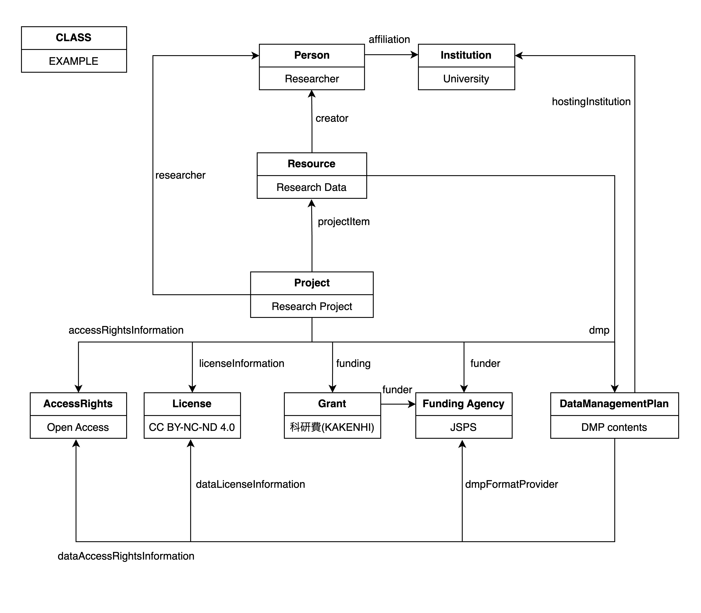

# Domain Model

The main entity is Project class in DG-AP domain model, unlike Resource and Activity class in RDM Ontology. This is because DG-AP supports only [Gakunin RDM](https://rdm.nii.ac.jp/) as a research data management platform for now. A project is base unit in Gakunin RDM and can exist without any files that is described by using Resource class. A instance of Project class in DG-AP indicates a single project of Gakunin RDM.

# Term Definitions Overview
|prefix|Namespace|
|--|--|
|rdm|https://purl.org/rdm/ontology/|
|owl|http://www.w3.org/2002/07/owl#|
|rdf|http://www.w3.org/1999/02/22-rdf-syntax-ns#|
|rdfs|http://www.w3.org/2000/01/rdf-schema#|
|xsd|http://www.w3.org/2001/XMLSchema#|

The following is a legend of term description.
||Term|
|--|--|
|URI|URI to the term|
|rdfs:comment|Comment in English Comment in Japanese|
|rdf:type|owl:ObjectProperty or owl:DatatypeProperty|
|rdfs:subClassOf/rdfs:subPropertyOf|super class/property|
|owl:inverseOf| inverse property|
|rdfs:domain|Domain class. Any of classes in list can be domain when multiple classes are listed. (unionOf)|
|rdfs:range|Range class or datatype. Any of these in list can be range when multiple items are listed.(unionOf)|
|note|Additional description|

## New Vocabulary

## RDM-O Classes

## RDM-O Properties